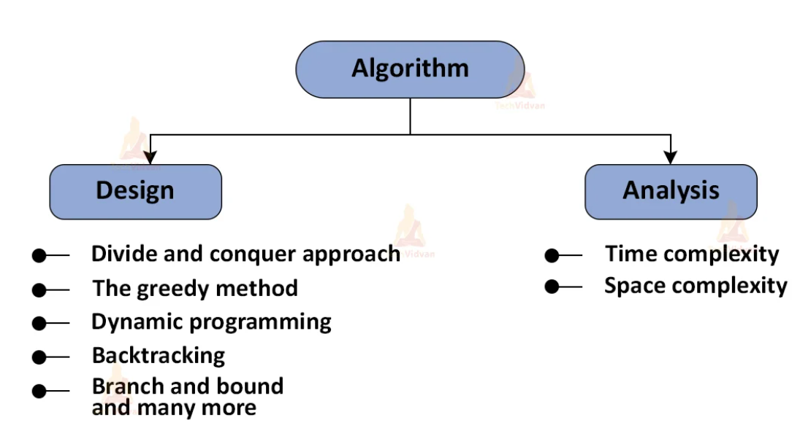

##  What is an Algorithms?

1. An algorithm is a step-by-step process to solve a particular problem or accomplish a particular task.

2. An algorithm is said to be correct if, for every input, it gives correct/expected output.

3. If the algorithm gives correct output for some inputs and wrong output for certain other inputs, then the algorithm is not correct.

4. We can represent an algorithm in simple English like sentences, as a computer program or as a flowchart.

5. Whenever we discuss algorithms in computer science, there are two aspects attached to it:

    * Designing an algorithm 
    * Analyzing an algorithm
  
##  Understanding Time Complexity with Simple Examples
Imagine a classroom of 100 students in which you gave your pen to one person. Now, you want that pen. Here are some ways to find the pen and what the O order is.
O(n2): You go and ask the first person of the class, if he has the pen. Also, you ask this person about other 99 people in the classroom if they have that pen and so on, 
This is what we call O(n2). 
O(n): Going and asking each student individually is O(N). 
O(log n): Now I divide the class into two groups, then ask: “Is it on the left side, or the right side of the classroom?” Then I take that group and divide it into two and ask again, and so on. Repeat the process till you are left with one student who has your pen. This is what you mean by O(log n). 
I might need to do the O(n2) search if only one student knows on which student the pen is hidden. I’d use the O(n) if one student had the pen and only they knew it. I’d use the O(log n) search if all the students knew, but would only tell me if I guessed the right side. 

NOTE : We are interested in rate of growth of time with respect to the inputs taken during the program execution .
